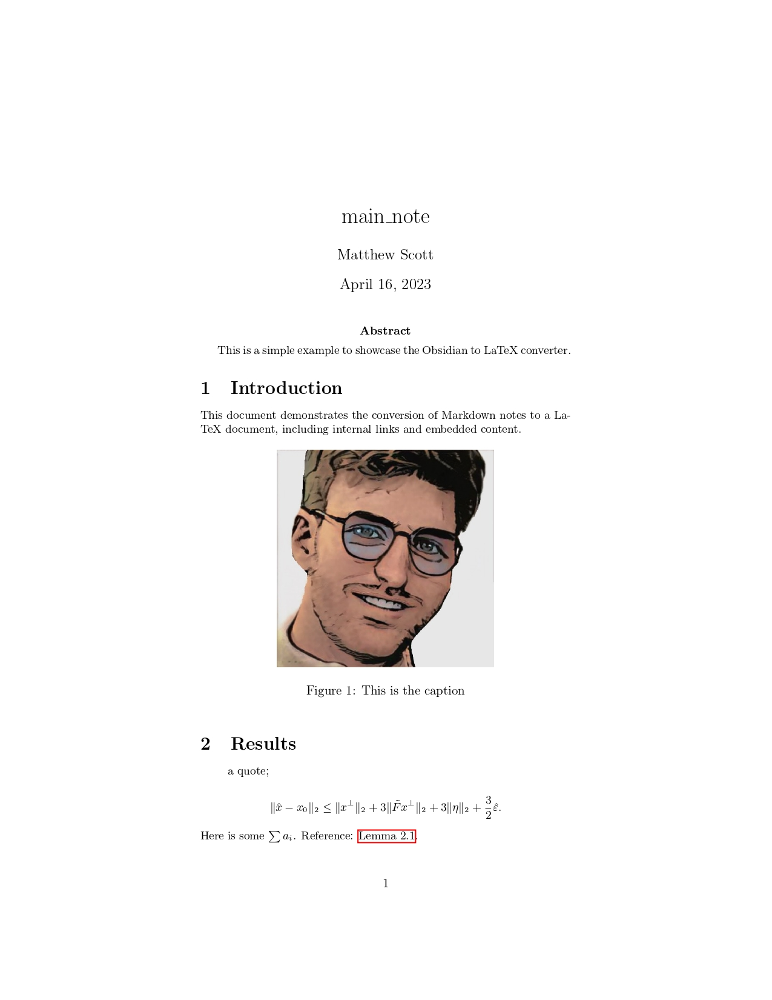
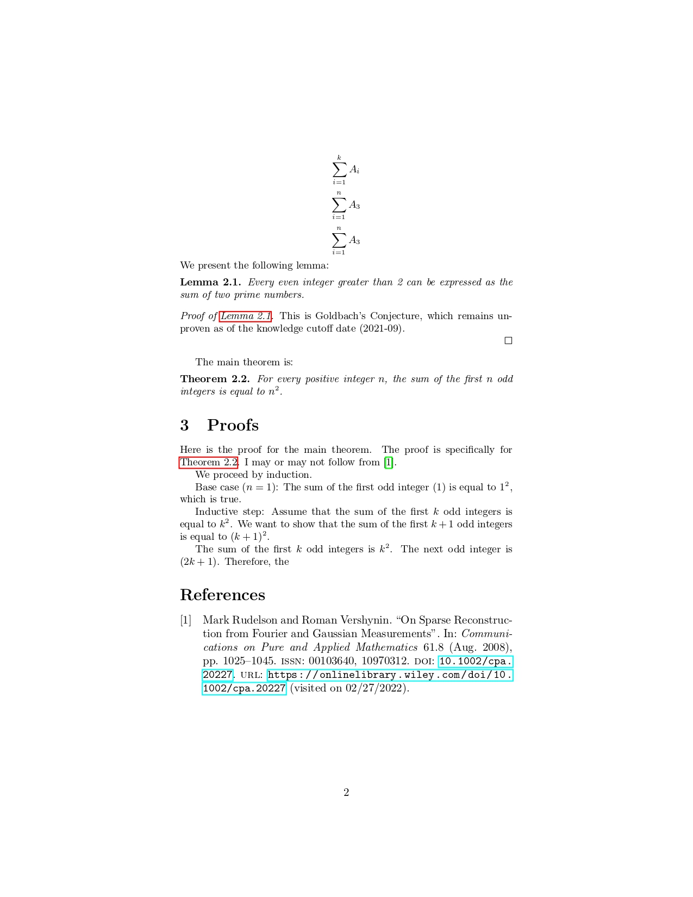

# Obsidian to LaTeX Math Academic Paper Exporter
This project exports an Obsidian note to a LaTeX math academic paper, retaining embeds as proofs and results. The main feature is to embed contents through Obsidian wikilinks from other local files.

This program takes a single obsidian-style markdown note and converts it to latex. If the note has a header named "Body", it will take the content below that header instead. The program will convert obsidian elements to latex elements.
## Usage
1. install julia: use [juliaup](https://github.com/JuliaLang/juliaup).
2. Clone this repository.
3. Copy the ./example subdirectory to use as boilerplate.
4. Modify the `config.yaml` to point to the correct locations. See what those paths should be [below](#config-file).
6. In a terminal, navigate to the example repository with 
```
cd ./Obsidian-Paper-Export/example
```
Then run it with 
```
./export.zsh
```
Alternatively, run the julia script directly:
    1. Set up a julia environment with the YAML package installed, or install it globally:
    ```
    julia -e "using Pkg; Pkg.add(\"YAML\")"
    ```
    2. 
    ```zsh
    julia ./path/to/main.jl ./path/to/config.yaml
    ```
7. Copy the example directory for each new export.
8. To edit the latex output, first copy it to some other place so that a future export will no overwrite it.
## Export and Overwritting Behaviour
Upon export, in the `example/tex_output/`, the `output.tex` file is overwritten as well as `example/tex_output/Files`, but other files `bibliography.bib` and `header.tex` are not overwritten. To manually edit the latex, you should copy the exported directory to another location.
## State of the Project
This project has only been tested on projects of the author, bug reports are appreciated.
## Config File
The config file is a YAML file that contains the following fields:
- `main_doc_template`: path to the latex template file for the main document. It should contain `$abstract` and `$body` placeholders.
- `ignore_quotes`: Whether to export quotes or ignore them. When ignoring quotes, they can be used as comments.
- `input_folder_path`: path to the folder containing the markdown files, including all files that are to be embedded by the main longform file. The files can be in any sub-directory of the input_folder_path.
- `output_folder_path`: path to the folder where the output files will be written. It will be created if it does not exist.
- `longform_file_name`: name of the file to treat as the main document. It should be in the input folder. This field should not be a path, and not include the file extension. If the file has path `.../input_folder/longform.md`, then the field should be `longform`.

## Known Limitations
There are two main limitations:
1. An embed link that is not on a new line. It will throw an error.
2. Display math symbols in the markdown should be on a new line (no \$\$ ... \$\$ inline).
3. Repeated embeds of the same file: if a file embedded multiple times, it will revert all but the first embed to a wikilink. This limitation is intentional: it allows for well-defined references.

## Supported Elements
Most markdown elements that you can find in obsidian are supported. 
### Markdown headers 
h1 headers become Latex sections h2 and onwards become subsections.

### Mathjax Math
Obsidian-style math is recognized. Anything `$inline_math$`and `$$ display_math$$`. These are rendered by default with the `\begin{equation*}` environment. If an `align` or `align*` environment is within dollar signs, it will be rendered using the corresponding environment instead.

### Note Embeds
Transcribes the content of note referred to by an embed link at the location of the link, in a way that matches what is seen in the reading view. The transcription is recursive; an embed in an embed will be embedded. Embeddings of sections of notes will also be embedded.

### Latex Environments
Results, remarks, proofs, lemmas and corollaries can be generated by specifying breadcrumbs-like attributes in front of the link. It takes the form `<environment_name>::![[FILE_NAME]]` on a new line. The embedded content will be inserted inside of a "environment" latex environment, where "environment".

### Internal References
Standard wikilinks will be converted to an `\autoref{}`. It will reference a latex section which was generated from the same note that is referenced by the wikilink. In case there is no embedded content matching it, it will create a dead reference.

### Figures
Figures are created from embed links referencing an image file. They are recognized by their file suffix. A caption can be added by putting it in the display section of the link: `![[image.jpeg|caption text here]]`.

Images will be copied to a folder "Files" in the output latex folder.

### Citations
Citations are wikilinks starting with the '@' character. Markdown citations are also supported. Citations can also have labels, in which case they look like `[<label>][[@<bibtex_key_1>]][[@<bibtex_key_2>]]` and gives an output of `\cite[<label>]{<bibtex_key_1>, <bibtex_key_2>}`.

This item is made to work with either markdown citations or either the "Zotero Integration" or the "Citations" plugin in Obsidian. Support is only tested for the wikilink format.

## Markdown Note Structure

I suggest to put each relevant result into its own note with a h1 header "statement" and one h1 header "Proof"; and possibly one #Remark.

To omit information at the end of files, use a line break `---`, and insert the information after. Only dashed line breaks will be considered for this.

## Demo
See the [exported markdown file](examples/main_note.md). It produces barebones latex, which yields:

Page 1 |   Page 2 
:-------------------------:|:-------------------------:
  |  
# Other projects
See also the Obsidian-to-latex repository in python for an alternative implementation with a different focus.
