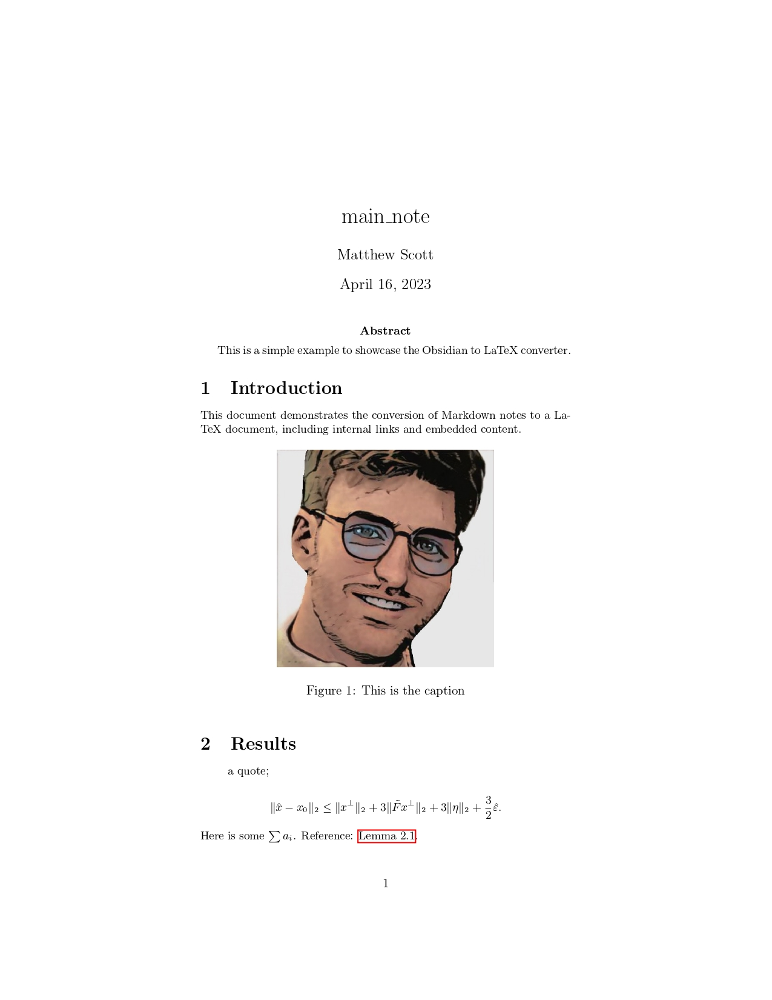
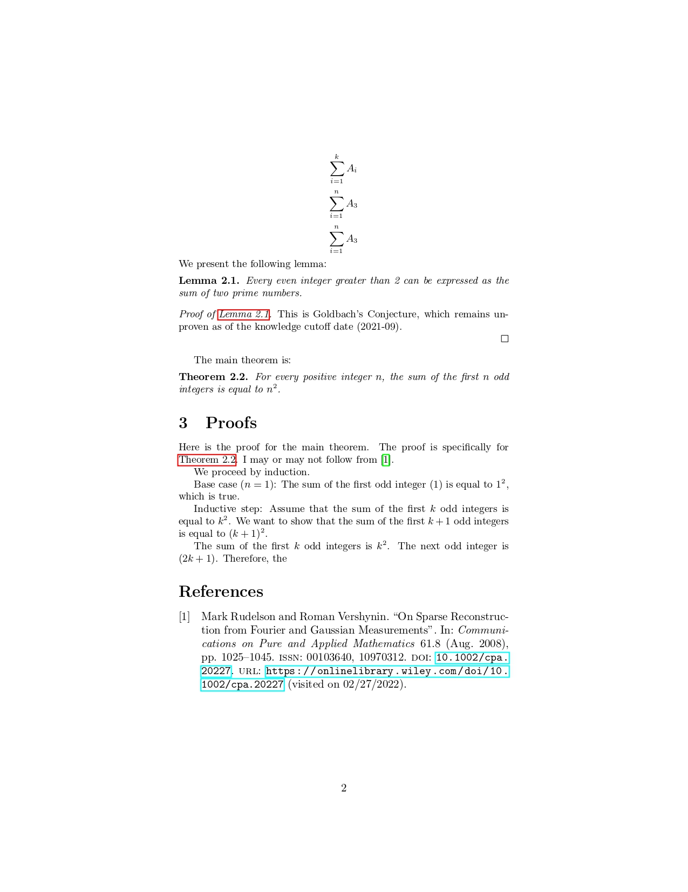

# Obsidian to LaTeX Math Academic Paper Exporter

This project exports an Obsidian note to a LaTeX math academic paper, retaining embeds as proofs and results. The main feature is to embed contents through Obsidian wikilinks from other local files.

## Usage
1. install julia: use [juliaup](https://github.com/JuliaLang/juliaup).

2. Add the YAML package globally: in a terminal, run
    ``` julia ``` to enter the julia REPL, then
    ```julia
    ] add YAML
    ```
    ```
    exit()
    ```
3. Clone this repository.
4. Make a config file as described [below](#config-file).
5. Optionally, add header and bibliography files to the output folder that is specified in the config file.
6. In a terminal, navigate to the repository folder and run the script:
    ```zsh
    julia ./src/main.jl <config_file_path>
    ```
    where `<config_file_path>` is the path to the config file you created.

## Config File
The config file is a YAML file that contains the following fields:
- `main_doc_template`: path to the latex template file for the main document. It should contain `$abstract` and `$body` placeholders.
- `ignore_quotes`: Whether to export quotes or ignore them. When ignoring them, quotes in markdown can be used to comment the markdown file without impacting the export.
- `input_folder_path`: path to the folder containing the markdown files, including the files that are to be embedded by the main longform file. All files should be in a single folder, no sub-folders are supported.
- `output_folder_path`: path to the folder where the output files will be written. It will be created if it does not exist.
- `longform_file_name`: name of the file to treat as the main document. It should be in the input folder. This field should not be a path, and not include the file extension. If the file has path `.../input_folder/longform.md`, then the field should be `longform`.

## Known Limitations
There are two main limitations:
1. An embed link that is not on a new line. It will throw an error.
2. Repeated Embeds: if a file embedded multiple times, it will revert all but the first embed to a wikilink. This limitation happens in order to have well-defined references.

## Supported Elements
Most markdown elements that you can find in the obsidian are supported. 
### Markdown headers 
h1 headers become Latex sections h2 and onwards become subsections.

### Mathjax Math
Obsidian-style math is recognized. Anything `$inline_math$`and `$$ display_math`. These are rendered by default with the `\begin{equation*}` environment. If an àlign`or àlign*` environment is within dollar signs, it will be rendered using the corresponding environment instead.

### Note Embeds
Transcribes the content of note referred to by an embed link at the location of the link, in a way that matches what is seen in the reading view. The transcription is recursive; an embed in an embed will be embedded. Embeddings of sections of notes will also be embedded.

### Latex Environments
Results, remarks, proofs, lemmas and corollaries can be generated by specifying breadcrumbs-like attributes in front of the link. It takes the form `<environment_name>::![[FILE_NAME]]` on a new line. The embedded content will be inserted inside of a "environment" latex environment, where "environment".

### Internal References
Standard wikilinks will be converted to an `\autoref{}`. It will reference a latex section which was generated from the same note that is referenced by the wikilink. In case there is no embedded content matching it, it will create a dead reference.

### Figures
Figures are created from embed links referencing an image file. They are recognized by their file suffix. A caption can be added by putting it in the display section of the link: `![[image.jpeg|caption text here]]`.

Images will be copied to a folder "Files" in the output latex folder.

## Markdown Note Structure

I suggest to put each relevant result into its own note with a h1 header "Statement" and one h1 header "Proof"; and possibly one #Remark.

To omit information at the end of files, use a line break `---`, and insert the information after. Only dashed line breaks will be considered for this.

## Demo
See the [exported markdown file](examples/main_note.md). It produces barebones latex, which yields:

Page 1 |   Page 2 
:-------------------------:|:-------------------------:
  |  
# Aknowledgement

See also the Obsidian-to-latex repository in python for an alternative implementation with a different focus.